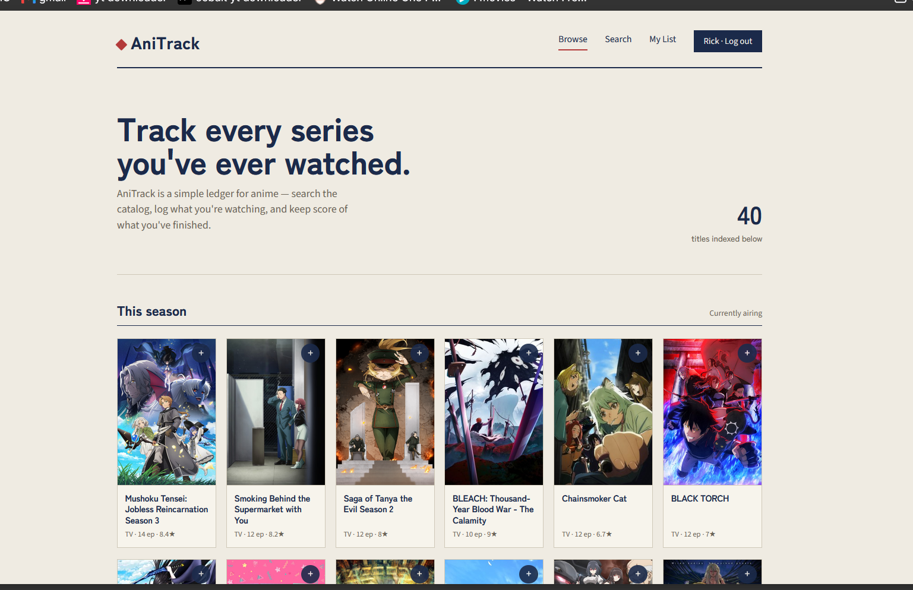

# AniTrack

A personal anime watchlist tracker, in the spirit of MyAnimeList. Search the
anime catalog, log what you're watching, rate and review, and see your stats.



## Stack

- **Frontend**: React 18 + Vite, React Router, plain CSS (no framework)
- **Backend**: Express + better-sqlite3
- **Auth**: JWT + bcrypt
- **Anime data**: [Jikan API](https://docs.api.jikan.moe/) (unofficial MyAnimeList REST API) — no key required

Your own database only stores accounts and each user's list entries
(status, score, progress, reviews). Anime metadata (titles, covers,
synopses) is fetched live from Jikan and cached briefly on the server.

## Project structure

```
anitrack/
  backend/     Express API (auth, list, anime proxy) + SQLite
  frontend/    React app (Vite)
```

## Running locally

### 1. Backend

```
cd backend
npm install
cp .env.example .env   # then edit JWT_SECRET
npm run dev
```

API runs on `http://localhost:5000`. SQLite file `anitrack.db` is created
automatically on first run.

### 2. Frontend

```
cd frontend
npm install
npm run dev
```

App runs on `http://localhost:5173` and proxies `/api` calls to the backend.

## API overview

| Method | Route              | Auth | Description                         |
|--------|---------------------|------|--------------------------------------|
| POST   | /api/auth/register  | —    | Create account, returns JWT          |
| POST   | /api/auth/login     | —    | Log in, returns JWT                  |
| GET    | /api/anime/search   | —    | Search anime (`?q=`)                 |
| GET    | /api/anime/top      | —    | Top-rated anime                      |
| GET    | /api/anime/season/now | —  | Currently airing season              |
| GET    | /api/anime/:id      | —    | Full detail for one title            |
| GET    | /api/list           | JWT  | Your list entries                    |
| GET    | /api/list/stats     | JWT  | Episode/score stats                  |
| POST   | /api/list           | JWT  | Add/update an entry                  |
| PATCH  | /api/list/:id       | JWT  | Update status/score/progress/review  |
| DELETE | /api/list/:id       | JWT  | Remove an entry                      |

## Next steps / ideas

- Reviews page showing all your written reviews
- Public profile pages (shareable list)
- Automatic retry on transient Jikan/MAL failures
- In future, add some manga option too- to also track manga read 
- Character and staff pages (Jikan supports these too)
- Rate-limit-aware request queue for Jikan (currently a simple 5-min cache)
